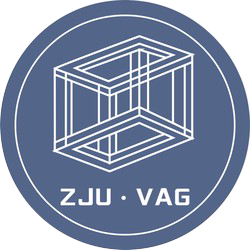

# NetV.js

[中文](./README-CHINESE.md) | [English](./README.md)

基于 WebGL 的大规模图可视化引擎

主页: http://netv.zjuvag.org/

## 特性

-   GPU 加速的大规模图数据渲染(支持千万级元素)
-   高性能 FPS 实时渲染
-   基于 WebGl 的快速交互响应

## 使用

下载 NetV.js 的地址: https://github.com/ZJUVAG/NetV.js/releases

或者从 CDN 引入: https://unpkg.com/netv/build/NetV.js

NPM 安装：

```bash
npm install netv
```

基础用法

```js
const testData = {
    nodes: [
        { id: '0', x: 300, y: 100 },
        { id: '1', x: 500, y: 100 },
        { id: '2', x: 400, y: 400 }
    ],
    links: [
        { source: '0', target: '2' },
        { source: '1', target: '2' }
    ]
}

const netv = new NetV({
    container: document.getElementById('main')
})
netv.data(testData)
netv.draw()
```

## 贡献

可以随时向我们提 issuse 或者提交贡献代码，具体细节可以查看 [开发指南](https://github.com/ZJUVAG/NetV.js/blob/dev/docs/development-guide-chinese.md).

## 团队

NetV.js 由  [浙江大学](http://www.zju.edu.cn/)和  [之江实验室](https://www.zhejianglab.com/)所有。  [浙江大学可视分析小组](https://zjuvag.org/)和  [之江实验室见微团队](https://jianwei.projects.zjvis.org/#/)的引导了相关开发。
