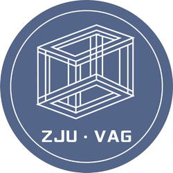

# NetV.js

[中文](./README-CHINESE.md) | [English](./README.md)

A large scale network visualization engine based on WebGL.

Homepage: http://netv.zjuvag.org/

## Features

-   GPU-accelerated render large-scale graphs (millons of elements)
-   High FPS for dynamic rendering graphs
-   Fast WebGL-based mouse interaction on graphs

## Usage

Download NetV.js from releases: https://github.com/ZJUVAI/NetV.js/releases

Or import from CDN: https://unpkg.com/netv/build/NetV.min.js

If you use npm, you can also install netv:

```bash
npm install netv
```

Basic example shows below:

```js
const testData = {
    nodes: [
        { id: '0', x: 300, y: 100 },
        { id: '1', x: 500, y: 100 },
        { id: '2', x: 400, y: 400 }
    ],
    links: [
        { source: '0', target: '2' },
        { source: '1', target: '2' }
    ]
}

const netv = new NetV({
    container: document.getElementById('main')
})
netv.data(testData)
netv.draw()
```

## Develop Guide

```bash
# start and install dependencies for all packages
$ npm run bootstrap

# build the packages
$ npm run build
```

```bash
# if you wanna watch one of the packages, e.g. packages/core
$ cd ./packages/core
$ npm run watch

# to add local dependences (add some local package as one dependency of another)
# first install lerna as a global package
$ npm install lerna -g
# second: lerna add local-package-1-name --scope=local-package-2-name
# e.g. add packages/core to packages/netv
# their names are defined in their corresponding "package.json"s
$ lerna add @netv/core --scope=netv
```

Feel freely submitting issues and pull requests. You may check our [contribution guide](./docs/development-guide.md).

## Team

NetV.js is owned by  [Zhejiang University](http://www.zju.edu.cn/) and  [Zhejiang Lab](https://www.zhejianglab.com/). The development of NetV.js is led by the  [Visual Analytics Group of Zhejiang University](https://zjuvag.org/) and  [Zhejiang Lab Jianwei Team](https://jianwei.projects.zjvis.org/#/).
