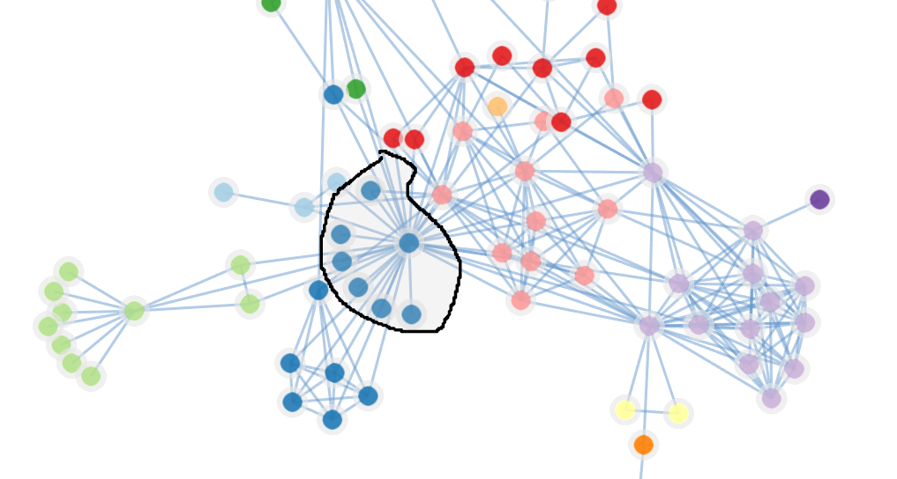

# netv-lasso-selection

Lasso plugin for NetV.js(http://netv.zjuvag.org/)

## API reference

### `lasso = new Lasso(netv, configs)`

Create lasso handler

* `netv: NetV`: pass core NetV object
* `configs: {}`: key-value pair configs
    * `enable: bool`: default enable lasso or not
    * `multiSelectKey: string`: key pressed when using multi-select, default is `'Shift'`
    * `pathStyle: {}`: lasso path style (below is supported attribute and their default value)
        * `fill`: `rgba(200, 200, 200, 0.2)`,
        * `stroke`: `black`,
        * `stroke-width`: `2`,
        * `stroke-dasharray`: `[]`,
        * `stroke-linejoin`: `round`,
        * `stroke-linecap`: `round`

### `lasso.dispose()`

Dispose lasso handler, clean related DOM element

### `lasso.enable()`

Manually enable lasso selection.

### `lasso.disable()`

Manually disable lasso selection.

### `lasso.closeDistance(distance: number)`

Set lasso's closeDistance to control the tolerance.

### `lasso.onSelected(callback: (nodes: Node[]) => {})`

Set callback function, the callback can get selected nodes in NetV's Node type.